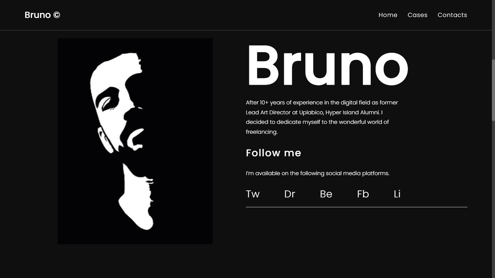
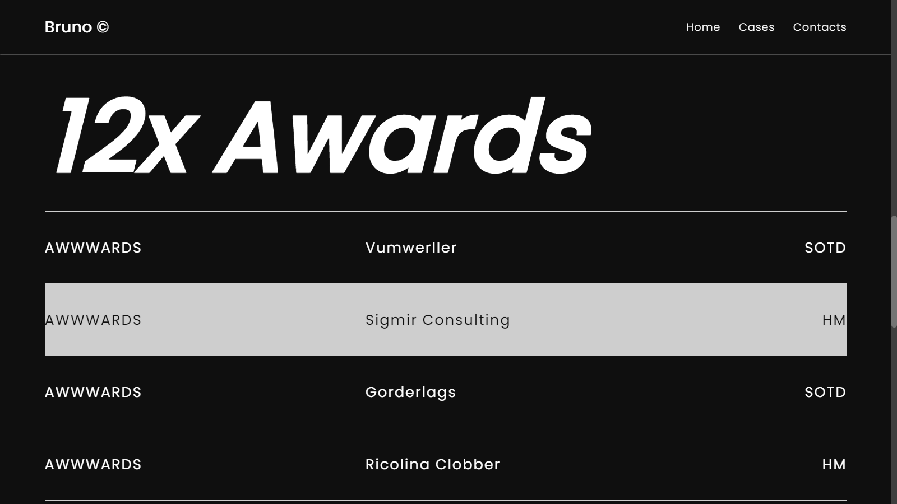
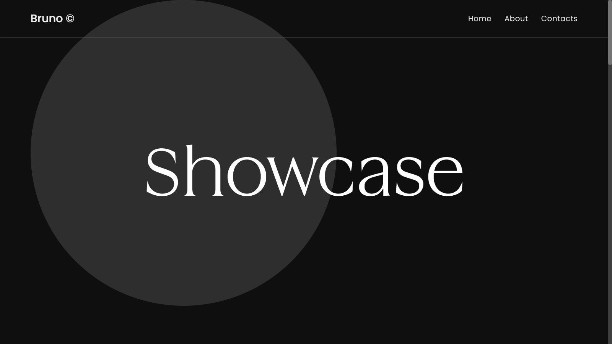
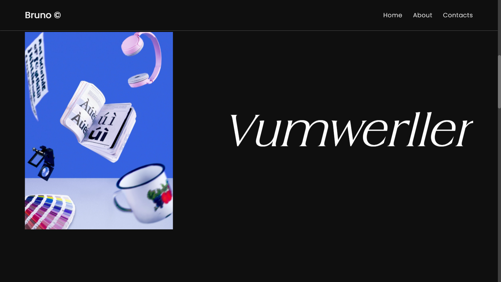
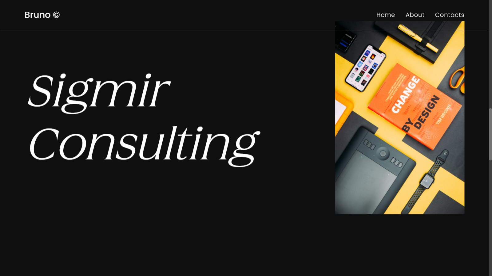

# Awwwards-rebuild-portfolio


Run locally by using this commands

```bash
# Install dependencies (only the first time)
npm install

# Run the local server at localhost:5000
npm start

# Build for production in the dist/ directory
npm run build
```


Site preview:


 <br>
 <br>
 <br>
 <br>
 <br>
 <br>
 <br>
 <br>
